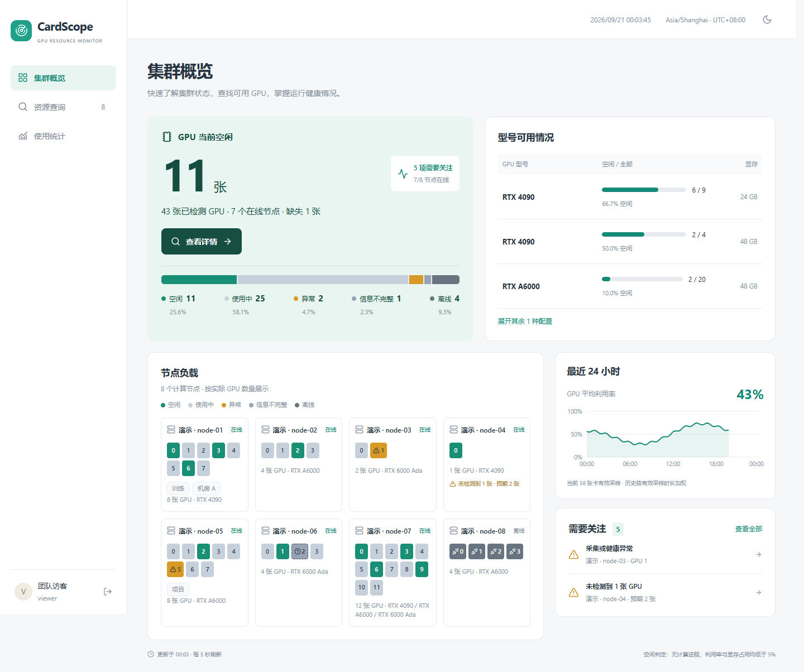

# CardScope

面向 Linux 多服务器、多显卡环境的轻量监控面板。客户端以普通用户身份运行，只主动上报采样数据；中心统一展示 GPU 状态、主机资源和用户占用卡时。



预览使用模拟数据，展示当前集群概览、型号可用情况、节点负载与利用率趋势。

## 特性

- 集中查看节点在线状态、GPU 利用率、显存、温度、功耗和计算进程。
- 统计节点与 UID 维度的用户占用卡时，并明确展示数据覆盖率。
- NVML 优先，失败时回退 `nvidia-smi`；支持 WSL 能力受限提示。
- 客户端断网缓存、恢复补传，中心按启动 ID 和序号幂等入库。
- 单个中心二进制内嵌前端，SQLite 存储，无需额外数据库。
- 客户端不监听端口，不需要 sudo，也不会接收中心下发的命令。

## 架构

```text
GPU 节点上的 gpu-agent
        │  HTTPS/HTTP 主动上报
        ▼
gpu-hub ── SQLite
   │
   └── 内嵌 Web 管理界面
```

项目处于早期阶段。生产部署前请阅读“尚未实机验证及明确限制”。

## 快速部署

下载对应架构发行包并解压。两端都以普通用户运行，使用用户 cron 开机启动和每分钟守护，不需要 sudo。机器需要已运行的 cron、Python 3.8+ 和 Bash。中心机不需要显卡。

```bash
# 新中心机器；首次交互设置 admin 与 viewer 密码
bash install-hub.sh
```

浏览器打开 `http://中心IP:8080`，使用 `admin` 登录，在“添加节点”生成一次性接入码。

```bash
# GPU 服务器普通用户执行；交互输入接入码
bash install-agent.sh http://中心IP:8080
```

以后解压新发行包，再执行对应的 `bash install-hub.sh` 或 `bash install-agent.sh` 即可升级；脚本保留数据和身份，自动备份并重启。已有服务端首次迁移时，先停止旧进程和旧守护任务，再执行 `bash install-hub.sh /原数据目录`。完整说明见 [安装与升级](docs/deployment.md)。

客户端需要机器已有 NVIDIA 驱动，并允许当前用户读取 GPU。中心监听 8080，客户端不监听端口。HTTP 按受控内网部署，当前不实现 TLS 或 SSH 拉取。直接运行二进制不需要 Python，可手动使用 `./gpu-hub serve --data ./data` 或 `./gpu-agent start`；上述安装脚本的 cron 守护需要 Python。

## 账号与节点

- `admin` 管理节点及账号密码；`viewer` 是团队共享只读账号。
- 首次设置密码至少 10 字节、最多 72 字节。修改密码会注销该账号所有会话。
- 接入码 15 分钟有效，仅能兑换一次。凭据仅保存哈希；撤销或重新签发立即停用旧凭据。
- 客户端配置默认 `~/.config/gpu-monitor/config.json`（遵循 XDG），权限 `0600`。可用 `GPU_AGENT_HOME` 指定独立目录。
- 重新接入同一个节点：停止客户端，在网页重新签发接入码，备份并移走原 `config.json`，再次执行 setup。原历史数据保留。
- 迁移到不同节点时使用新的 `GPU_AGENT_HOME`，不要复用旧缓存队列。
- 不采集环境变量、完整命令行和用户目录内容；服务端不能向客户端下发命令。
- WSL 的 CPU、内存、网卡是 WSL 范围。GPU 与 Windows 共享，进程归属标记受限。

## 登录页文案

管理员在“节点管理 → 登录页文案”中修改顶部标语、主标题、说明文字和底部文字。支持换行，留空隐藏；保存到中心数据库，服务重启后保留。文案对未登录访客公开，仅按纯文本展示。

## 指标解释

- NVML 优先，初始化或设备获取失败时回退 `nvidia-smi`。不支持的单项指标保留空值。
- `—` 代表不可用而不是零。显卡消失、查询失败、权限不足和驱动报告丢失分别显示。
- GPU UUID 是持久身份；索引仅显示。预期卡数在节点管理设置。
- 每 5 秒采集，硬件枚举每 60 秒；可在首次 setup 用 `--interval 2..20` 调整。已有配置的 `interval` 若超过 20，需先改为 2～20 秒再启动客户端。
- 节点 30 秒未实时上报标记离线；补传历史不刷新在线状态。
- 网络逐接口记录。节点管理中明确选择汇总接口，避免 bond/bridge/VLAN 和底层接口重复相加。未选时只显示主要接口，不合计全部网卡。RDMA 不保证覆盖。
- 磁盘容量按挂载点，I/O 按设备。不扫描文件目录，不对各层块设备求总和。
- 用户以“节点 + UID”区分，PID 配合创建时间辨别进程。普通用户权限或命名空间限制时显示未知。
- “疑似空闲”要求查询有效、无计算进程、GPU 利用率 <5%、显存占用 <5%。信息受限、离线或指标缺失时不会判断为空闲。
- MIG/MPS 无法可靠归属时不生成用户卡时；第一版不折算实例到物理卡算力。

## GPU-hours

1. 整卡占用时长：有计算进程的时间，每张卡每个区间只算一次。
2. 利用率加权时长：利用率 × 有效时间。例如 50% 持续 2 小时为 1 GPU-h，不代表 FLOPs。
3. 用户持卡时长：用户在卡上有计算进程的时间，同一用户同一卡多进程去重。两人共享 1 小时，各记 1 小时，合计可超过整卡时长。

按真实采样时间积分。间隔超过两倍采样周期、客户端重启或指标缺失时区间未知。统计覆盖率独立显示，不把缺口填零。按型号分组，不折算不同卡的等效算力，不用于计费。

统计选择范围按分钟（长周期按小时）边界对齐，API 返回实际范围；CSV 包含起止时间。用户统计没有“用户计算利用率”，该列为空。未知用户不会被归到运行客户端的账号。

## 存储与运行

中心使用 SQLite WAL。原始系统/GPU 指标 48 小时，分钟聚合 30 天，小时汇总 500 天，进程及健康变化事件 30 天。每小时清理一次。进程仅在状态变化时保存事件。

客户端先写入本地队列再异步上报，网络超时不阻塞采集。首次启动实际预分配 100 MiB 的 `queue.bin` 循环缓存，包含元数据及对齐开销；最多保留 24 小时，容量不足时覆盖旧数据并累计缺口数量。预分配失败会明确报错，旧 JSON 队列在启动时自动迁移（迁移前需额外空出 100 MiB）。恢复后先上传最新数据，随后限速补传。中心按节点、启动 ID、序号去重，乱序样本会修正相邻区间统计。

备份：先正常停止中心服务，再备份整个 `--data` 目录（含可能存在的 WAL/SHM 文件）。恢复时保持文件由运行用户所有；首次启动不会重置已有账号。

升级：先停止旧进程，再替换程序并启动。不要从 Windows 直接覆盖 WSL 中正在运行的程序。客户端对同一配置目录使用运行锁，防止重复采集导致重复统计。

服务日志不记录接入码、节点凭据或密码。错误上报仅返回错误类别。接口限制请求体和字段数量，采用 JSON、CSRF、会话认证和请求限速。

## API

所有接口以 `/api/v1` 开头：

| 接口 | 权限 / 用途 |
| --- | --- |
| POST /login, POST /logout, GET /me | 网页会话 |
| GET /nodes | 管理员 / 只读查看 |
| POST /nodes | 管理员创建节点及接入码 |
| PATCH /nodes/{id} | 名称、预期卡数、汇总网卡 |
| POST /nodes/{id}/enrollment, /revoke | 重新签发 / 撤销 |
| POST /enroll | 一次性接入码换节点凭据 |
| POST /snapshots | 节点 Bearer 凭据，仅能写自身 |
| GET /history?node=&gpu=&from=&to= | GPU 分钟/小时趋势 |
| GET /stats, GET /export | 节点/型号/用户过滤的统计和 CSV |
| GET /events?node=&gpu= | 最近 100 条变化事件 |
| POST /accounts/password | 管理员修改 admin/viewer 密码 |

网页写操作使用 `X-CSRF-Token`。快照版本为 1，带 `node_id / boot_id / seq / at / interval / backfill` 以及系统/GPU 指标；时间为 Unix 毫秒。拒绝超前 30 秒或早于 25 小时的样本，确保机器时间基本同步。

## 开发与发行

目录职责见 [项目结构](docs/architecture.md)，本地开发和测试入口见 [开发说明](docs/development.md)。

需要 Go 1.26+、Node 20.19+（20.x）或 22.12+、npm；仅构建环境需要这些工具。

```bash
python -m pip install -r requirements-dev.txt

cd web
npm ci
npm run format:check
npm run build
cd ..

go test ./...
ruff format --check scripts tests
ruff check scripts tests
sh scripts/build/build.sh
```

Windows 可运行 `scripts/build/build.ps1`。前端构建产物写入 `internal/webui/assets/dist`，随后嵌入中心程序。Linux amd64/arm64 使用 `CGO_ENABLED=0`，运行时无需安装 C 编译器。

本机 WSL 验证脚本 `tests/integration/wsl-smoke.py` 仅用于开发：使用 `/tmp/gpu-monitor-local` 私有状态，启动真实 hub/agent，不施加 GPU 负载。测试报告见 `docs/testing.md`。

## 用户使用统计

使用统计默认显示最近 7 天，按节点和 UID 汇总用户占用卡时、使用卡数，按占用卡时降序排列。点击用户行展开显卡明细。同名用户不跨节点合并。支持时间、节点、型号、用户名或 UID 筛选，导出当前筛选的用户汇总。加权卡时和整卡统计不再显示在这个页面。

有观测缺口的记录标记“有缺口”，展开可看用户归属覆盖率。无法获取用户归属时不会虚构用户或零使用记录。

## 参与贡献与安全

提交代码前请阅读 [CONTRIBUTING.md](CONTRIBUTING.md)。不要在公开 Issue 中粘贴凭据、内网地址、主机名或未脱敏日志。

## 许可证

本项目采用 [Apache License 2.0](LICENSE)。
